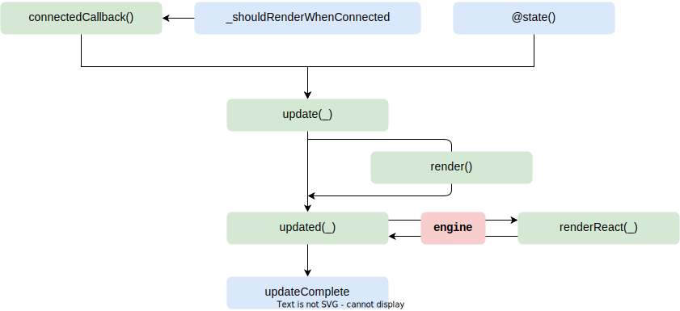

# back-kit-engine/base

`base` contains the superclass extension of [`lit`][lit]'s [`LitElement`](https://lit.dev/docs/api/LitElement).
By extending such class we get a custom web-component standard lifecycle plus the extra methods
provided by the [`lit`][lit] library. On top of this latter lifecycle, base superclasses have support for:

- [micro-lc][micro-lc]'s [element-composer][element-composer] interface
- http client with stateful properties (baseUrl and headers)
- lifecycle syncing with React-based components using this library's [engine]('../engine/README.md)

## Base Superclasses

There are 4 base web components extendible classes

- BkBase
- BkComponent
- BkHttpBase
- BkHttpComponent

long story short, `*Http*`s are equivalent counterparts to `BkBase` and `BkComponent`
only carrying an extra http client (fetch) already configured according
to the component properties `basePath` and `headers`.

Each of these must be linked on startup to a [ReplaySubject][ReplaySubject] instance from [rxjs][rxjs].
More details can be found on this topic on mia's Backoffice [docs][BO].
Simply put, any component in the web page is connected to a pub/sub channel,
called by us an `EventBus` (its TS type ships with this library).
Such channel allow listening and emitting events from and to the component.
Such a way no component is aware of anything else in the document beside the channel
itself and the business logic it contains.

Be aware of the following interface (implemented by `BkComponent` and `BkHttpComponent`) which will become handy:

```typescript
interface LitCreatable<P = Record<string, never>> {
  renderRoot: HTMLElement | ShadowRoot
  Component: FunctionComponent<P>
  create?: () => P
}
```

Thus any webcomponent is linked to a React Function Component which has props `P`
and will provide the user with a `create` function to establish
at each render which props to pass down to the React component instance.
Aside there's a render root which might be in the DOM or a shadow root.
The library used to build webcomponents is [lit-elements][lit].

## Lifecycle

By extending `LitElement` class, superclasses provide an extension of the `lit` lifecycle.

### Connection

On mount, onto the DOM, a custom component is instantiated using its constructor. This phase,
is one-to-one with the side-effect of the following snippet  of code

```html
<custom-component></custom-component>
<script type="module">
  class CustomComponent extends BkBase {
    /** Logic */
  }
  customElements.define('custom-component', CustomComponent)
</script>
```

then the `connectedCallback()` is executed. After this, any `property` assigned to the component
is effectively stored within its `this`

```html
<custom-component></custom-component>
<script type="module">
  import {ReplaySubject} from 'rxjs/internal/ReplaySubject'
  /**
   * definitions and classes
   */

  const el = document.querySelector('custom-component')
  el.eventBus = new ReplaySubject()
</script>
```

`eventBus` in this case will be available only when `firstUpdated()` is called:


After that, it is recommended, though not mandatory, to trigger re-renders only when `@state()`
properties change. Anyway, when lit updates the component it executes a render, if extending either
`BkComponent` or `BkHttpComponent`, otherwise skips the step.

On `render()` a `slot` element is attached to the reader root, awaiting for React to replace it.
To ensure `render()` is completed, the webcomponent-react sync is executed on `updated()` method
which calls the react render function.

### Removal

Removing a component which uses the react-sync engine, triggers the methods of the `ReactDOM`
namespace, namely `disconnectedCallback()` calls `ReactDOM.unmountComponentAtNode()`.


as a side effect a private variable `_shouldRenderWhenConnected` is set to `true`.
This behaviour is needed since lit's `isConnected` variable is already true when `connectedCallback()`
is called and React needs to re-render if a re-connection is taking place. When re-appending a component,
as per the snippet below:

```html
<body>
  <custom-component></custom-component>
  <script type="module">
    import {ReplaySubject} from 'rxjs/internal/ReplaySubject'
    /**
     * definitions and classes
     */

    const el = document.querySelector('custom-component')
    /**
     * set properties
     */

    const {parentElement} = el
    el.remove() // disconnect
    parentElement.appendChild(el) // re-connect
  </script>
</body>
```

no state changed and no property is initialized but a React render is needed to re-create
the component.

This lifecycle obviously don't apply when `BkBase` or `BkHttpBase` is used.

### Re-Connection

On reconnection, a simplified lifecycle is introduced into the component



## Element-Composer interface

The element composer plugin initialize each html tag following the next snippet

```javascript
/**
 * `properties` is a string to any object
 * `attributes` is an string to string object
 * `container` is the designated parent to which append new nodes
 */
const el = document.createElement('custom-element')
for (const k in properties) {
  el[k] = properties[k]
}
for(const k in attributes) {
  el.setAttribute(k, attributes[k])
}
container.appendChild(el)
```

By the documentation we learn that 3 properties are automatically injected

- `eventBus`
- `headers`
- `currentUser`

Superclasses provide a wrapper on `eventBus` setter to start listening as soon as it is set.
`*Http*` superclasses behaves the same with both `eventBus` and `headers`.
There's no special lifecycle associated with `currentUser` since it belongs to business
logic feature which usually go after the render of a component.

The bulk of the actions taken into the `connectedCallback()` can thus be further magnified
following the next diagram:


On connection a new `Subscription` is created to avoid memory leaks while subscribing to an
`eventBus` pub/sub channel.

`bootstrap` is another lifecycle available to the developer which doesn't involve pub/sub
operations and it is executed after listener registration.

Finally, the `eventBus` can be read from the very beginning or after the component is being
connected. To allow this, an observable called `_kickoff` emits once on connection and is
passed on each listener.

## Superclasses

### BkBase

As the name suggests, it is the lowest building block. If a component extends it one has:

- the rendering root is the `shadowRoot` (overridable as per lit [docs][lit-docs-shadowRoot])
- an `EventBus` object must be connected to the component. It doesn't really matter when. Without it nothing will break but the component won't do anything. On `EventBus` set, achievable as per the code snippet below, the component will bind to the component class instance anything is passed through the constructor. By this trickery we get to run lifecycle on `EventBus` set instead of the constuctor which it ain't accessible while writing a plain html page with custom tags.

```javascript
document.querySelector('my-custom-tag').eventBus = new rxjs.ReplaySubject()
```

Cool! Let's see the construcor which takes two arguments: listeners and bootstrappers.

A `Listener` is a function like

```typescript
type Listener = (eventBus: EventBus, kickoff: Observable<0>) => Subscription
```

and is executed when the `EventBus` is attached.
A listener allows the component to react when a given event is piped in the `EventBus`.
A subscription must be returned to avoid memory leaks on component destruction/detachment.

A `Bootstrapper` is a function like

```typescript
type Bootstrapper = (eventBus: EventBus, kickoff: Observable<0>) => void
```

and as the name suggests will take care of *una-tantum* operations.
Most of the time a bootstrapper reads current browser state (URL, history and so on...)
to decode startup settings which override its defaults.

ℹ️ To do that we attached in this library a `getURLParams` method in the module `utils`.

`Listeners` and `Bootstrappers` can be none, one or an array of them.

Beside these information, any component extending `BkBase` will follow the implementation of webcomponents
described above.

#### Properties & Attributes

| property | attribute | type | default | description |
|----------|-----------|------|---------|-------------|
|`currentUser`| - |Record<string, unknown>|{}|[micro-lc-element-composer](https://microlc.io/documentation/docs/micro-lc/core_plugins#microlc-element-composer) default prop representing the authenticated user. It's context can be configured via micro-lc backend config files.|
|`proxyWindow`| - |Window & typeof globalThis|window|a window that might support sandboxed logic/methods |
|`eventBus`| - |undefined \\| EventBus| - |[micro-lc-element-composer](https://microlc.io/documentation/docs/micro-lc/core_plugins#microlc-element-composer) default prop representing the `eventBus` default channel unless overridden by `busDiscriminator` prop.|

### BkComponent

This component renders on the DOM by default (as per it runs `lit`'s render method).
As such, its constructor wants to know which React component (`Component` argument)
it must render and how to compute props (`create` argument).
It passes down `Listeners` and `Bootstrappers` to `BkBase` which is its `super`.

There's a concept of connection/update/render/disconnection to the real DOM,
but React re-render needs are taken care by the component.
Any component extending this one will need to **only** compute props as per its business logic.

This component again has a shadowRoot.

#### Properties & Attributes

| property | attribute | type | default | description |
|----------|-----------|------|---------|-------------|
|`currentUser`| - |Record<string, unknown>|{}|[micro-lc-element-composer](https://microlc.io/documentation/docs/micro-lc/core_plugins#microlc-element-composer) default prop representing the authenticated user. It's context can be configured via micro-lc backend config files.|
|`proxyWindow`| - |Window & typeof globalThis|window|a window that might support sandboxed logic/methods |
|`eventBus`| - |undefined \\| EventBus| - |[micro-lc-element-composer](https://microlc.io/documentation/docs/micro-lc/core_plugins#microlc-element-composer) default prop representing the `eventBus` default channel unless overridden by `busDiscriminator` prop.|

### BkHttpBase and BkHttpComponent

Extends the previous superclasses providing an extra prop

```typescript
@property() basePath?: string
```

combined with the `headers` property described before, it initializes a `protected` http
client wrapper of `fetch`. Such client can be imported also from `@micro-lc/back-kit-engine/utils`
by using

```typescript
export declare type HttpClientConfig = Omit<RequestInit, 'method'> & {
    params?: string | Record<string, string> | string[][] | URLSearchParams
    inputTransform?: (data: any) => BodyInit | null | undefined
    outputTransform?: (body: Body) => Promise<any>
    error?: (err: unknown) => Promise<unknown>
    raw?: boolean
    downloadAsFile?: boolean
}

export declare type HttpClientInstance = {
    get: GetHandler
    post: PostHandler
    put: PostHandler
    delete: PostHandler
    postMultipart: PostMultipartHandler
    fetch: FetchHandler
}

export declare function createFetchHttpClient(this: HttpClientSupport): HttpClientInstance;
```

Any rerender involving state change of `headers` and/or `basePath` triggers a re-creation
of the client to reflect the changed properties.

#### Properties & Attributes


| property | attribute | type | default | description |
|----------|-----------|------|---------|-------------|
|`currentUser`| - |Record<string, unknown>|{}|[micro-lc-element-composer](https://microlc.io/documentation/docs/micro-lc/core_plugins#microlc-element-composer) default prop representing the authenticated user. It's context can be configured via micro-lc backend config files.|
|`proxyWindow`| - |Window & typeof globalThis|window|a window that might support sandboxed logic/methods |
|`basePath`| - |undefined \\| string| - |http client base path |
|`eventBus`| - |undefined \\| EventBus| - |[micro-lc-element-composer](https://microlc.io/documentation/docs/micro-lc/core_plugins#microlc-element-composer) default prop representing the `eventBus` default channel unless overridden by `busDiscriminator` prop.|
|`headers`| - |undefined \\| Record<string, string>| - |http client custom headers |

[rxjs]: https://rxjs.dev
[ReplaySubject]: https://rxjs.dev/api/index/class/ReplaySubject
[BO]: https://docs.mia-platform.eu/docs/business_suite/backoffice/overview
[lit]: https://lit.dev/
[lit-docs-shadowRoot]: https://lit.dev/docs/components/shadow-dom/#renderroot
[mui]: https://mui.com
[antd]: https://ant.design
[stencil]: https://stenciljs.com
